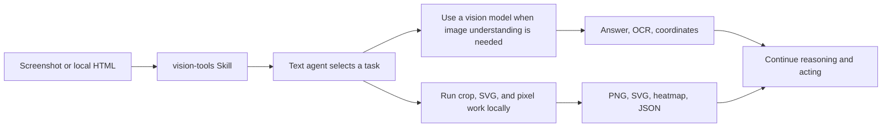

<p align="center">
  
</p>

<div align="center">

# DSH Vision Toolkit

[](https://dshfind.com/en/plugins/Anionex/dsh-vision-toolkit)
[](https://dshfind.com/en/plugins/Anionex/dsh-vision-toolkit)
[](https://www.npmjs.com/package/@anionex/dsh-vision-toolkit)
[](LICENSE)
[](cordis.patch.yml)

**What it thinks is what it sees — give text-only DeepSeek Harness agents eyes to understand images, locate interfaces, extract assets, and finish visual work with verifiable results.**

🚀 Paste an image and ask directly | Install with one command | Built-in free quota | Seamless Web / Headless workflow

🌐 **English** | [中文](README.zh.md)

</div>

## Do these problems look familiar?

If you use DeepSeek or another text-only model in DeepSeek Harness (DSH), you may have hit one or more of these barriers:

1. **Pasted images are rejected.** You have to switch models manually or copy image paths into the conversation.
2. **The model cannot see what matters.** Screenshots, webpages, and interfaces must be described again in words before the agent can help.
3. **Generic captions are not enough.** Without coordinates, OCR, or task context, image tools fall short on UI restoration, long screenshots, and other demanding work.
4. **Setup gets in the way.** You still have to find a vision provider and configure an API key before trying anything.

## Highlights

- **Paste and use it immediately.** Paste an image in DSH Web and the text-only route switches to its image-enabled (`Vision Toolkit`) variant without manual path copying or model changes.
- **A seamless image workflow.** Native thumbnails, session history, and workspace paths stay intact; Web can preview artifacts, while Headless runs can continue from the same structured results.
- **One command to install.** The built-in free Gemma 4 vision service is ready after installation, with no API key required.
- **Built-in free quota.** The shared service currently includes 100 requests per client per day, 400 requests globally per day, and a 20-request burst per 60 seconds, with readable errors when a limit is reached.
- **Vision guided by intent.** The agent extracts evidence for the task at hand, such as “Where is the error?” or “Where is the button?”, instead of returning a generic caption.
- **Outputs that keep working.** Coordinates, OCR, crops, transparent PNGs, SVGs, heatmaps, and JSON can feed directly into the next step.
- **A complete screenshot-to-verification loop.** Reference images, HTML screenshots, difference regions, and pixel comparison work together for UI restoration.

## From understanding an image to finishing the task

[`agent-vision-toolkit`](https://github.com/Anionex/agent-vision-toolkit) gives an agent more than image captions: it can read, locate, crop, trace, rebuild, and verify visual work. DSH Vision Toolkit is its native DeepSeek Harness integration, bringing that workflow into Web and Headless Profiles.

This project has two layers:

1. **Visual tools and a Skill:** the agent learns when to inspect, ground, OCR, crop, trace, or compare pixels.
2. **Native DSH integration:** those capabilities live inside Profiles, sessions, Settings, Artifacts, and the Web UI, with a free Gemma 4 vision service ready after installation.

> **Install and use it immediately.** The default setup includes a free Gemma 4 vision service and requires no API key. Cropping, pixel diffing, color analysis, foreground extraction, SVG tracing, and HTML screenshots run locally without spending vision API requests.

```sh
dsh plugin --profile web add @anionex/dsh-vision-toolkit
```

**Upstream toolkit:** [Anionex/agent-vision-toolkit](https://github.com/Anionex/agent-vision-toolkit) · **Project website:** [agent-vision.anionex.me](https://agent-vision.anionex.me)

<details>
<summary><strong>Table of contents</strong></summary>

- [Recent updates](#recent-updates)
- [Who it is for](#who-it-is-for)
- [See it in action](#see-it-in-action)
- [Quick start: three steps](#quick-start-three-steps)
- [Common workflows](#common-workflows)
- [Toolbox](#toolbox)
- [Configuration and limits](#configuration-and-limits)
- [Troubleshooting](#troubleshooting)
- [Development and community](#development-and-community)

</details>

## Recent updates

- **2026-08-16 · Windows Python:** Added Microsoft Store Python support, fixing first-time isolated-runtime setup failures for affected Windows users.
- **2026-08-16 · Better free vision:** Switched the default model to Gemma 4, improving the no-key image-understanding path.
- **2026-08-16 · Image paste:** Text-only routes now switch to a `(Vision Toolkit)` variant and keep a workspace path, fixing blocked pastes and images that could not be reused later.
- **2026-08-16 · Higher free quotas:** Raised per-client, global, and burst limits to `100/day`, `400/day`, and `20/minute`, reducing avoidable rate-limit failures while the shared capacity is lightly used.
- **2026-08-16 · Real model test:** Added a full image-request test in Settings, fixing the false confidence caused by a successful `/models` request to a model that still cannot process images.

## Who it is for

This plugin is for anyone using a text-only agent in DSH to work with screenshots, webpages, interfaces, icons, long images, or visual differences. It is especially useful when:

| The problem | What Vision Toolkit delivers |
|---|---|
| **A text-only model cannot see a screenshot** | Paste an image in DSH Web; the plugin obtains visual evidence and returns the task-relevant parts to the text model |
| **The description is long but misses the point** | Ask “Where is the error?” or “What color is the submit button?” and receive an answer focused on that question |
| **The model knows an element exists but cannot act on it** | Get original-image pixel coordinates and an optional labeled or numbered preview |
| **Long-screenshot OCR skips or duplicates lines** | Split and audit the image while preserving Markdown, chunks, manifests, and resumable run state |
| **UI restoration is judged by feel** | Compare the reference and implementation screenshots to get a difference percentage, ranked regions, a heatmap, and JSON |
| **Screenshot assets cannot be reused** | Produce a crop, transparent PNG, color palette, or editable SVG instead of stopping at prose |

## See it in action

### Paste an image directly into DSH

<p align="center">
  
</p>

*Paste an image into the conversation. A text-only model can switch to its `Vision Toolkit` variant and inspect the image in the context of the user's question.*

### Screenshot to editable page

<p align="center">
  
  
</p>

*Left: the reference screenshot. Right: an editable HTML/CSS result. The result can continue into screenshot rendering and pixel comparison instead of ending as an image description.*

### Sketch to working interface

<p align="center">
  
  
</p>

*Left: a hand-drawn reference. Right: the working interface reconstructed from it.*

### Turn “looks close” into a verifiable result

The repository includes a reproducible UI-restoration example: the agent renders the reference and implementation, then uses difference regions, a heatmap, and a JSON report to guide the next correction.

<p>
  
  
</p>

## Quick start: three steps

### 1. Install

```sh
dsh plugin --profile web add @anionex/dsh-vision-toolkit
```

You can install it into a Headless Profile too:

```sh
dsh plugin --profile headless add @anionex/dsh-vision-toolkit
```

### 2. Restart and check it

Restart a running Web Profile, then open **Settings → Vision Toolkit**. The free provider is already configured; run **Test vision model** to confirm it is reachable.

The first start prepares an isolated runtime, so it needs access to the Python package cache or the network. A normal installation does not require an `agent-vision-toolkit` source checkout or a local path setting.

### 3. Paste an image and describe the outcome you want

Paste a screenshot into the conversation or place an image in the session workspace, then invoke `/vision-tools`. For example:

```text
Inspect this screenshot. Explain the error and tell me what to fix first.
Find the login button in the top-right corner, return original pixel coordinates, and make a boxed preview.
Crop this icon and convert it to SVG.
Rebuild the page from reference.png. After each pass, render it and run a pixel diff until the major differences are gone.
```

## Common workflows

| Task | Recommended workflow |
|---|---|
| Image Q&A or screenshot debugging | Inspect → answer around the current question → locate details when needed |
| Find a button, icon, or text region | Ground the target → return pixel box → create a labeled preview |
| Extract an icon from a screenshot | Ground → crop → trace to SVG |
| Read a long webpage screenshot | Split → OCR → merge Markdown → audit boundaries |
| Recreate a page or component | Reference → implementation → HTML screenshot → pixel diff → iterate |
| Extract brand visuals | Crop region → analyze dominant colors → extract foreground → export transparent PNG |

## Toolbox

The plugin provides 10 tools that can be called independently or composed into a workflow:

| Tool | Best question to ask | Main result |
|---|---|---|
| `vision_glance` | “What is happening in this image?” | Focused answer, description, OCR, or multi-image comparison |
| `vision_ground` | “Where is the thing I need?” | Original pixel coordinates and optional boxed preview |
| `vision_detect` | “Which buttons, icons, or elements are present?” | Numbered element inventory, coordinates, and optional preview |
| `vision_crop` | “Extract this region as its own image” | PNG or JPEG crop |
| `vision_trace` | “Turn this shape into an editable vector” | SVG |
| `vision_pixel_diff` | “Where does the implementation differ from the reference?” | Difference percentage, ranked regions, heatmap, and JSON |
| `vision_long_screenshot_ocr` | “Read this entire long screenshot” | Markdown, chunks, manifest, and audit output |
| `vision_extract_foreground` | “Remove the background from this subject” | Transparent PNG |
| `vision_dominant_colors` | “Which colors dominate this area?” | Palette or ranked candidate colors |
| `vision_html_screenshot` | “Render this local page at an exact viewport or capture the full page” | PNG and optional CSS `pageHeight` |

Coordinates always use original-image pixels in `x1,y1,x2,y2` form, so grounding output can feed directly into cropping, tracing, or later automation.

For a long HTML document, pass `fullPage=true`. The requested width and height remain the layout viewport, while the resulting PNG covers the complete document and reports `pageHeight` in CSS pixels.

## How it works

The plugin keeps image understanding and deterministic local image processing in one Agent workflow. Expand the flow below for the implementation boundary.

<details>
<summary><strong>Architecture and image-input behavior</strong></summary>



The visual capabilities come from a packaged, pinned `agent-vision-toolkit` snapshot. The DSH plugin handles installation, session-scoped tool exposure, Credentials, path checks, cancellation, timeouts, result files, and Web presentation. The runtime never fetches upstream `main` in the background.

For routes that DSH positively identifies as text-only, the plugin registers a sibling `<model> (Vision Toolkit)` variant. By default, pasting an image in DSH Web switches to that variant and gives the model both a reusable workspace path and a visual description focused on the current task.

</details>

## Configuration and limits

### Built-in free service

The default setup uses:

```text
Base URL: https://vision.anionex.me/v1
Model:    gemma-4-26b-a4b-it
API Key:  no user configuration required
```

This is a shared zero-configuration entry point, not an unlimited private endpoint. Current limits are:

| Limit | Current value |
|---|---:|
| Per client | 100 requests per UTC day |
| Whole service | 400 requests per UTC day |
| Burst | 20 requests per 60 seconds |
| Image size | 4 MiB per image |
| Decoded pixels | 20,000,000 per image |
| Output | 512 tokens per request |

The limits protect shared capacity and prevent unusually large images from monopolizing memory or request time. When a limit is reached, the service returns a readable reason and error code. Rate-limit responses also include `Retry-After` instead of collapsing into an unexplained model failure.

### Bring your own vision model

For higher quotas, private endpoints, or another model, change the provider in **Settings → Vision Toolkit** and store the API key as a DSH Credential. Settings stores the Credential reference and never reads the saved secret back into the browser.

You can also configure a Profile patch:

```yaml
- id: vision-toolkit
  config:
    provider:
      baseUrl: https://api.example.com/v1
      credential: MY_VISION_KEY
      model: your-vision-model
      protocol: openai
```

OpenAI Chat Completions-compatible endpoints and Anthropic Messages are supported. The Web Settings panel exposes the full provider, runtime, timeout, image-limit, and image-input-variant configuration.

### Requirements

- A DeepSeek Harness Web or Headless Profile.
- Node.js `^22.19.0` or `>=24.0.0`.
- Python 3.11+; the plugin prepares an isolated environment by default.
- Only `vision_html_screenshot` requires Chrome, Chromium, or Edge.
- Inputs must be PNG, JPEG, GIF, or WebP files in the session workspace or an explicitly allowed directory.

<details>
<summary><strong>Install, upgrade, disable, and uninstall</strong></summary>

```sh
dsh plugin --profile web update @anionex/dsh-vision-toolkit
dsh plugin --profile web remove @anionex/dsh-vision-toolkit
```

If you are migrating from the retired `@dsh-external/dsh-vision-toolkit`, remove the old package first and install `@anionex/dsh-vision-toolkit`.

To disable the bundle temporarily, set this in the Profile patch:

```yaml
- id: vision-toolkit
  disabled: true
```

Restart the Web Profile and refresh the page after enabling or upgrading the Web plugin.

</details>

### Plugin updates

In **Settings → Vision Toolkit**, **Check for updates** queries the Profile's npm registry. For a direct registry installation, **Update and restart** installs only the exact version you confirmed, verifies it, and restarts an explicitly opted-in POSIX Web process on a fixed `--port`. Local/workspace/file/git/URL installs, Windows, dynamic ports, read-only Profiles, and manager-owned processes remain check-only.

The updater revalidates the Profile before mutation, snapshots the original manifest and lockfile, and holds a token-owned cross-process lock. The current Web process exits only after the restart helper confirms that the backup is readable and the lock handoff succeeded. When the Profile was already operational, the replacement must report both the target plugin version and a ready runtime; failed replacements restore the original manifest/lockfile and rebuild dependencies with a frozen lockfile before retrying the previous exact version. If automatic recovery itself fails, the backup and lock are preserved and their paths are written to `$DSH_HOME/logs/vision-toolkit-restart.log`. Detached restart requires `DSH_VISION_TOOLKIT_ALLOW_DETACHED_RESTART=1`; unsaved Settings or API-key input blocks installation.

## Troubleshooting

| Problem | What to do |
|---|---|
| Pasting an image still says the model does not support image input | Restart the Web Profile, refresh the page, and confirm the selected route has the `(Vision Toolkit)` suffix. You can also place the image in the session workspace and invoke `/vision-tools` |
| The free service returns 429 | Wait for the `Retry-After` interval, or switch to your own endpoint when you need stable higher volume |
| The image exceeds a size or pixel limit | Crop or resize it first; the error identifies whether bytes or decoded pixels caused the rejection |
| A custom Credential is missing | Enter the API key in **Settings → Vision Toolkit** and confirm the Credential name matches the provider configuration |
| First-time runtime setup fails | Check Python 3.11+, network or package-cache access, and disk permissions, then retry the model test in Settings |
| Chrome is not found | Install Chrome, Chromium, or Edge. Only HTML screenshot rendering is unavailable; the other tools still work |
| An artifact cannot be previewed | Use **Open file** or the workspace path in the result. Preview URLs exist only while the Web route is available |

## Project status and limitations

The current release focuses on screenshot understanding, visual grounding, OCR, asset extraction, UI restoration, and pixel-level verification. It is not a video, audio, or camera-input system and does not automatically click GUI controls. Interactive box editing, remote service clusters, model voting, and cross-session visual caches are also outside the current scope.

## Development and community

```sh
pnpm install --frozen-lockfile --trust-lockfile
pnpm run verify:portable
pnpm run build
pnpm test
TSX_TSCONFIG_PATH=tsconfig.json pnpm dlx tsx scripts/ui-restoration-example.ts --check
```

- Read [CONTRIBUTING.md](CONTRIBUTING.md) before contributing.
- Use [GitHub Issues](https://github.com/Anionex/dsh-vision-toolkit/issues) for bugs, focused feature requests, and usage questions; see [SUPPORT.md](SUPPORT.md) for channel guidance.
- Report vulnerabilities privately through [SECURITY.md](SECURITY.md).
- See [CHANGELOG.md](CHANGELOG.md) for releases and [FUNDING.md](FUNDING.md) for sponsorship details.
- Visit upstream [agent-vision-toolkit](https://github.com/Anionex/agent-vision-toolkit) for the general toolkit, cross-agent integrations, and visual-task playbooks.

<p align="center">
  
</p>

[`agent-vision-toolkit`](https://github.com/Anionex/agent-vision-toolkit) was created by [Anionex](https://anionex.me/). This repository maintains its native DeepSeek Harness integration.

## License

The plugin is available under the [MIT License](LICENSE). The packaged upstream snapshot retains its original MIT license in [`vendor/agent-vision-toolkit/LICENSE`](vendor/agent-vision-toolkit/LICENSE).
